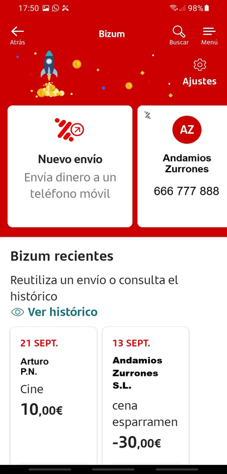

# 📱 Santander Clone — UD1 Práctica: Análisis y desarrollo de apps

Este repositorio contiene el desarrollo del ejercicio práctico de la **UD1: Análisis y desarrollo de apps**, basado en la interfaz **Bizum del Banco Santander**.

El proyecto ha sido desarrollado en **React Native (Expo)** aplicando el principio de **Atomic Design** para organizar los componentes visuales y la arquitectura de la interfaz.

---

## 🧭 Estructura del repositorio

| Carpeta | Descripción |
|----------|--------------|
| `pgl-appscreen-santander/` | Código fuente de la aplicación React Native |
| `docs/` | Documentación en formato Markdown (colores, Atomic Design, componentes, iconos) |
| `assets/` | Recursos gráficos e imágenes |
| `docs/img/` | Capturas de pantalla de los códigos y resultados |

---

## 📚 Documentación

Los apartados solicitados en la práctica se encuentran organizados dentro de la carpeta `docs/`:

1. [🎨 Colores utilizados en la app](./docs/1-colors.md)  
2. [🧩 Organización según Atomic Design](./docs/2-atomic-design.md)  
3. [🧱 Implementación de componente propio (`ActionCard`)](./docs/3-actioncard.md)  
4. [⚙️ Iconos incorporados e implementación](./docs/4-icons.md)

---

## 🖼️ Comparativa visual

**Captura original (Bizum Santander):**


**Resultado en la app desarrollada:**


---

## ⚙️ Ejecución del proyecto

Para ejecutar el proyecto localmente:

```bash
npm install
npx expo start
