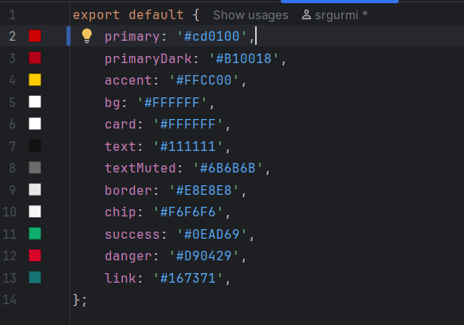

# 🧩 2. Organización según Atomic Design (Santander Clone)

Basándome en el principio de **Atomic Design**, la interfaz de la app se ha estructurado en diferentes niveles:  
**átomos, moléculas, organismos, plantillas y páginas**, lo que permite una jerarquía **reutilizable, mantenible y escalable**.

---

## ⚛️ Átomos (Atoms)

| 🧩 **Componente** | 📝 **Descripción** | 📱 **Ejemplo en la app** |
|:------------------|:------------------|:--------------------------|
| `TextPrimary` | Texto principal o título | “Bizum recientes”, “Nuevo envío” |
| `TextSecondary` | Texto informativo | “Reutiliza un envío o consulta el histórico” |
| `Icon` | Iconos individuales | Cohete, lupa, engranaje |
| `Avatar` | Imagen o iniciales del contacto | “AZ” de Andamios Zurrones |
| `Button` | Botón de acción | “Ver histórico” |

---

## ⚙️ Moléculas (Molecules)

| ⚛️ **Componente** | 🧠 **Descripción** | 🧩 **Composición** |
|:------------------|:------------------|:-------------------|
| `ActionCard` | Tarjeta para acciones principales | `Icon` + `TextPrimary` + `TextSecondary` |
| `TransactionItem` | Elemento con información de envío <br> reciente | `TextPrimary` + `TextSecondary` + `TextHighlight` |

---

## 🧩 Organismos (Organisms)

| 🧱 **Componente** | 📝 **Descripción** | 🧩 **Contiene** |
|:------------------|:------------------|:----------------|
| `Header` | Cabecera de la app con título e iconos | `TextPrimary` + `Icon` + `Button` |
| `MainActions` | Zona con las acciones principales | 2 × `ActionCard` |
| `RecentTransactions` | Histórico de transacciones | `TextPrimary` + lista de `TransactionItem` |

---

## 🧱 Plantillas (Templates)

| 🧩 **Componente** | 📝 **Descripción** | 🧩 **Contiene** |
|:------------------|:------------------|:----------------|
| `BizumTemplate` | Estructura general de la pantalla | `Header` + `MainActions` + `RecentTransactions` |

---

## 📱 Página (Page)

### `BizumScreen.tsx`

```tsx
export default function BizumScreen() {
  return (
    <View style={styles.root}>
      <Header title="Bizum" />
      <MainActions />
      <RecentTransactions />
    </View>
  );
}
```

<p align="center">  </p> ```