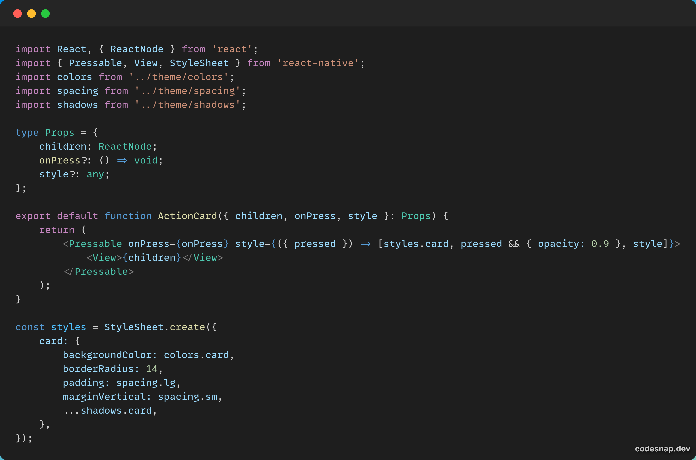

# 🧱 3. Implementación de un componente propio: `ActionCard`

En la aplicación **Santander Clone**, se ha implementado un componente personalizado llamado `ActionCard`.  
Este componente pertenece al nivel de **moléculas** dentro del modelo Atomic Design y se utiliza para mostrar tarjetas reutilizables.

---

## 💡 Descripción del componente

El componente `ActionCard` actúa como un **contenedor genérico** para mostrar información con un mismo estilo visual.  
En la pantalla principal (`BizumScreen`), se usa para:

- Mostrar una tarjeta con el botón “Nuevo envío”.
- Mostrar una tarjeta con los datos del contacto favorito (nombre, avatar y teléfono).

---

## 🧩 Código del componente

```tsx
import React from 'react';
import { View, StyleSheet } from 'react-native';
import colors from '../theme/colors';
import spacing from '../theme/spacing';

export default function ActionCard({ children, style }: { children: React.ReactNode, style?: any }) {
  return <View style={[styles.card, style]}>{children}</View>;
}

const styles = StyleSheet.create({
  card: {
    backgroundColor: colors.surface,
    borderRadius: 16,
    padding: spacing.lg,
    shadowColor: '#000',
    shadowOpacity: 0.1,
    shadowOffset: { width: 0, height: 2 },
    shadowRadius: 4,
    elevation: 3,
  },
});
```

<p align="center">  </p> ```

