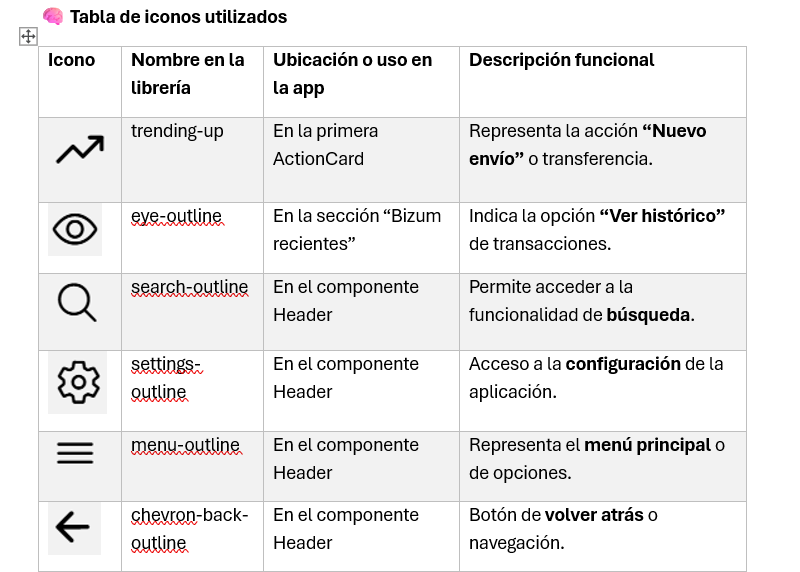

# ⚙️ 4. Iconos incorporados y su implementación

En la aplicación **Santander Clone**, se han usado varios **iconos vectoriales** para mejorar la experiencia visual y reforzar las acciones principales de la interfaz.

Todos los iconos provienen de la librería [`@expo/vector-icons`](https://docs.expo.dev/guides/icons/) — específicamente del set **Ionicons**.

---

## 🧠 Tabla de iconos utilizados

| Icono | Nombre                | Uso en la app               | Descripción                       |
|:-----:|:--------------------|:---------------------------|:---------------------------------|
| 🔼    | `trending-up`        | Primera `ActionCard`       | Representa la acción “Nuevo envío” |
| 👁️    | `eye-outline`        | Sección “Bizum recientes” | Muestra el histórico de envíos   |
| 🔍    | `search-outline`     | Componente `Header`        | Acceso a búsqueda                 |
| ⚙️    | `settings-outline`   | Componente `Header`        | Acceso a configuración            |
| ☰     | `menu-outline`       | Componente `Header`        | Menú principal                    |
| ◀️    | `chevron-back-outline` | Componente `Header`      | Navegación atrás                  |

---

## 💻 Ejemplo de implementación

```tsx
import { Ionicons } from '@expo/vector-icons';

<Ionicons
  name="trending-up"
  size={30}
  color={colors.primary}
/>
```

